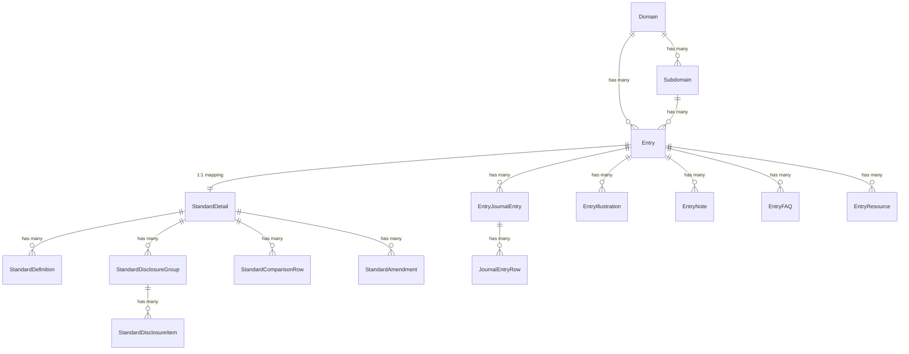

# Accounts.Life — Database Schema Guide

This document defines the schema models and relationship maps deployed in the PostgreSQL database via Prisma.

---

## Model Reference & Key Fields

### 1. Domain Taxonomy
* **`Domain` (mapped to `domains` table):**
  * Core fields: `id` (PK), `domainCode` (Unique - e.g. D01, D02), `domainName`, `domainSlug` (Unique), `domainColorHex`, `domainStatus` (Enum: ACTIVE, PARTIAL, COMING_SOON).
  * Has many `Subdomain` and `Entry` records.
* **`Subdomain` (mapped to `subdomains` table):**
  * Core fields: `id` (PK), `domainId` (FK), `subdomainName`, `subdomainSlug`.
  * Unique constraint: `[domainId, subdomainSlug]`.
  * Belongs to one `Domain`, has many `Entry` records.

### 2. General Content Entries
* **`Entry` (mapped to `entries` table):**
  * The master record containing all concepts, standards, and journal entry topics.
  * Core fields: `id` (PK), `entryType` (Enum: CONCEPT, STANDARD, JOURNAL_ENTRY, GLOSSARY_TERM, ILLUSTRATION, FAQ, REFERENCE), `entryTitle`, `entrySlug` (Unique), `domainId` (FK), `subdomainId` (FK), `summary`, `entryBody` (Json block-editor payload), `verificationLevel`, `status` (Enum: DRAFT, PUBLISHED).
  * Relates to one `StandardDetail` (1:1), many `EntryJournalEntry`, many `EntryIllustration`, many `EntryNote`, many `EntryFAQ`, many `EntryResource`.

### 3. Compliance Frameworks (1:1 with standard Entry)
* **`StandardDetail` (mapped to `standard_details` table):**
  * Core fields: `id` (PK), `entryId` (Unique FK), `standardCode` (e.g. AS 1), `standardFramework` (Enum: AS, IND_AS), `issuingBody` (e.g. ICAI), `dateEffective`, `applicabilitySummary`, `objectiveText`, `scopeStatement`.
  * Has many `StandardDefinition`, `StandardDisclosureGroup`, `StandardComparisonRow`, and `StandardAmendment` records.
* **`StandardDefinition`:** Holds official definitions matching specific standard clauses.
* **`StandardDisclosureGroup` / `StandardDisclosureItem`:** Holds structured lists of disclosure requirements.
* **`StandardComparisonRow`:** Represents comparison criteria between AS and Ind AS.

### 4. Educational Blocks & Assets
* **`EntryJournalEntry` / `JournalEntryRow`:** Stores scenarios, narrations, and structured debits/credits.
* **`EntryIllustration`:** Holds scenarios, working notes, solutions, and financial statement impact grids.
* **`EntryNote`:** Holds callouts (e.g. IMPORTANT, NOTE, TIP, CAUTION).
* **`EntryFAQ`:** Stores questions and answers with standard references.
* **`GlossaryTerm` (mapped to `glossary_terms` table):**
  * Holds dictionary terms.
  * Fields: `id` (PK), `term` (e.g. Asset), `termSlug` (Unique), `shortDefinition`, `fullDefinition` (Json), `authoritySource`, `relatedTerms` (Json string array), `standardRefs` (Json string array).

---

## Entity Relationship Overview

